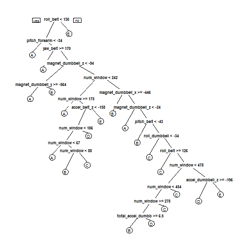

## Project Background

Using devices such as Jawbone Up, Nike FuelBand, and Fitbit it is now possible to collect a large amount of data about personal activity relatively inexpensively. These type of devices are part of the quantified self movement - a group of enthusiasts who take measurements about themselves regularly to improve their health, to find patterns in their behavior, or because they are tech geeks. One thing that people regularly do is quantify how much of a particular activity they do, but they rarely quantify how well they do it. The goal of this project is to use data from accelerometers on the belt, forearm, arm, and dumbell of 6 participants. They were asked to perform barbell lifts correctly and incorrectly in 5 different ways. More information is available from the website here: http://groupware.les.inf.puc-rio.br/har (see the section on the Weight Lifting Exercise Dataset). 

The training data for this project are available here:
https://d396qusza40orc.cloudfront.net/predmachlearn/pml-training.csv

The test data are available here: 
https://d396qusza40orc.cloudfront.net/predmachlearn/pml-testing.csv

The data for this project come from this source: http://groupware.les.inf.puc-rio.br/har

--- .class #id

## Loading and cleaning up the data

- Data is loaded.
- Columns filled with NA values are deleted as they are not going to be good predictors
- The first 5 columns are also removed as they contain only descriptive information like name, timestamps.
- Training data is further split into 


```r
options(warn=-1)
suppressMessages(library(caret))
Train <- read.csv("pml-training.csv")
Train <- Train[colSums(is.na(Train))==0] #Columns with NA values deleted
Train <- Train[,6:93]                    #Descriptive columns deleted
inTrain <- createDataPartition(y=Train$classe,p=0.75,list=FALSE)
training <- Train[inTrain,]
testing <- Train[-inTrain,]
```

--- .class #id

## Predictor Selection

- Near zero covariates are removed


```r
nsv <- nearZeroVar(training, saveMetrics = T)
head(nsv,7)
```

```
##                      freqRatio percentUnique zeroVar   nzv
## new_window           44.566563     0.0135888   FALSE  TRUE
## num_window            1.133333     5.8228020   FALSE FALSE
## roll_belt             1.120536     7.8067672   FALSE FALSE
## pitch_belt            1.013245    11.7203424   FALSE FALSE
## yaw_belt              1.014851    12.3929882   FALSE FALSE
## total_accel_belt      1.037206     0.1902432   FALSE FALSE
## kurtosis_roll_belt 1799.375000     2.1470308   FALSE  TRUE
```

```r
training <- training[, !nsv$nzv]
```

--- .class #id

## Training the model using Decision Tree
The first method used to train the data is using Prediction Trees

```r
suppressMessages(library(rpart))
suppressMessages(library(rpart.plot))
tree <- rpart(classe~.,method="class",data=training)
prp(tree)
```

 

--- .class #id

## Evaluating Decision Tree 


```r
predTree <- predict(tree,newdata=testing,type="class")
confusionMatrix(predTree,testing$classe)
```

```
## Confusion Matrix and Statistics
## 
##           Reference
## Prediction    A    B    C    D    E
##          A 1261  146   12   39   19
##          B  106  696   96  201  172
##          C    0   57  676   38    2
##          D   25   41   68  460   91
##          E    3    9    3   66  617
## 
## Overall Statistics
##                                           
##                Accuracy : 0.7565          
##                  95% CI : (0.7443, 0.7685)
##     No Information Rate : 0.2845          
##     P-Value [Acc > NIR] : < 2.2e-16       
##                                           
##                   Kappa : 0.6909          
##  Mcnemar's Test P-Value : < 2.2e-16       
## 
## Statistics by Class:
## 
##                      Class: A Class: B Class: C Class: D Class: E
## Sensitivity            0.9039   0.7334   0.7906   0.5721   0.6848
## Specificity            0.9384   0.8546   0.9760   0.9451   0.9798
## Pos Pred Value         0.8538   0.5476   0.8745   0.6715   0.8840
## Neg Pred Value         0.9609   0.9304   0.9567   0.9185   0.9325
## Prevalence             0.2845   0.1935   0.1743   0.1639   0.1837
## Detection Rate         0.2571   0.1419   0.1378   0.0938   0.1258
## Detection Prevalence   0.3012   0.2592   0.1576   0.1397   0.1423
## Balanced Accuracy      0.9212   0.7940   0.8833   0.7586   0.8323
```

--- .class #id

## Training the model using Decision Tree with Cross Validation

- Define cross-validation experiment
- Perform the cross validation
- Create a new CART model


```r
suppressMessages(library(e1071))
set.seed(1)
fitControl <- trainControl(method="cv",number=10)
cartGrid <- expand.grid(.cp=(1:50)*.01)
cv <- train(classe~.,data=training,method="rpart",trControl=fitControl,tuneGrid=cartGrid) #From this we find that best control parameter for highest accuracy is cp=0.01
treeCV <- rpart(classe~.,data=training,method="class",control=rpart.control(cp=0.01))
```

--- .class #id

## Evaluating Decision Tree with Cross Validation


```r
predTreeCV <- predict(treeCV,newdata=testing,type="class")
confusionMatrix(predTreeCV,testing$classe)
```

```
## Confusion Matrix and Statistics
## 
##           Reference
## Prediction    A    B    C    D    E
##          A 1261  146   12   39   19
##          B  106  696   96  201  172
##          C    0   57  676   38    2
##          D   25   41   68  460   91
##          E    3    9    3   66  617
## 
## Overall Statistics
##                                           
##                Accuracy : 0.7565          
##                  95% CI : (0.7443, 0.7685)
##     No Information Rate : 0.2845          
##     P-Value [Acc > NIR] : < 2.2e-16       
##                                           
##                   Kappa : 0.6909          
##  Mcnemar's Test P-Value : < 2.2e-16       
## 
## Statistics by Class:
## 
##                      Class: A Class: B Class: C Class: D Class: E
## Sensitivity            0.9039   0.7334   0.7906   0.5721   0.6848
## Specificity            0.9384   0.8546   0.9760   0.9451   0.9798
## Pos Pred Value         0.8538   0.5476   0.8745   0.6715   0.8840
## Neg Pred Value         0.9609   0.9304   0.9567   0.9185   0.9325
## Prevalence             0.2845   0.1935   0.1743   0.1639   0.1837
## Detection Rate         0.2571   0.1419   0.1378   0.0938   0.1258
## Detection Prevalence   0.3012   0.2592   0.1576   0.1397   0.1423
## Balanced Accuracy      0.9212   0.7940   0.8833   0.7586   0.8323
```

--- .class #id

## Training the model with Random Forests

In random forests, there is no need for cross-validation or a separate test set to get an unbiased estimate of the test set error. It is estimated internally during the run. However, the error does decrease with the number of trees. 


```r
suppressMessages(library(randomForest))
set.seed(1)
forest <- randomForest(classe~.,data=training,ntree=200,nodesize=25)
```

--- .class #id

## Evaluating Random Forests


```r
predForest <- predict(forest, newdata=testing)
confusionMatrix(predForest,testing$classe)
```

```
## Confusion Matrix and Statistics
## 
##           Reference
## Prediction    A    B    C    D    E
##          A 1394    4    0    0    0
##          B    1  944   15    0    0
##          C    0    1  840    8    0
##          D    0    0    0  794    3
##          E    0    0    0    2  898
## 
## Overall Statistics
##                                           
##                Accuracy : 0.9931          
##                  95% CI : (0.9903, 0.9952)
##     No Information Rate : 0.2845          
##     P-Value [Acc > NIR] : < 2.2e-16       
##                                           
##                   Kappa : 0.9912          
##  Mcnemar's Test P-Value : NA              
## 
## Statistics by Class:
## 
##                      Class: A Class: B Class: C Class: D Class: E
## Sensitivity            0.9993   0.9947   0.9825   0.9876   0.9967
## Specificity            0.9989   0.9960   0.9978   0.9993   0.9995
## Pos Pred Value         0.9971   0.9833   0.9894   0.9962   0.9978
## Neg Pred Value         0.9997   0.9987   0.9963   0.9976   0.9993
## Prevalence             0.2845   0.1935   0.1743   0.1639   0.1837
## Detection Rate         0.2843   0.1925   0.1713   0.1619   0.1831
## Detection Prevalence   0.2851   0.1958   0.1731   0.1625   0.1835
## Balanced Accuracy      0.9991   0.9953   0.9901   0.9934   0.9981
```

--- .class #id

## Conclusion

Out of the three models that were tried, it is clear that Random Forest is the best model with an accuracy of 99.3%. With Decision Tree, both models - with and without cross validation gave an accuracy of above 70%. It is interesting to note that there was no noticable improvement in performance of the decision tree even after performing a 10 fold cross validation.

Let's apply the Random Forest model to the test data set that was provided. From our model we can expect an out of sample error of 0.7% 


```r
finalTest <- read.csv("pml-testing.csv")
Final_Prediction<-predict(forest,finalTest)
Final_Prediction
```

```
##  1  2  3  4  5  6  7  8  9 10 11 12 13 14 15 16 17 18 19 20 
##  B  A  B  A  A  E  D  B  A  A  B  C  B  A  E  E  A  B  B  B 
## Levels: A B C D E
```

The Random Forest model has correctly predicted all values as verified by online submission.

--- .class #id
